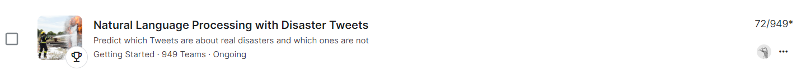

# Disaster Tweets Classification
By: Niv Dobzinski (PhD)

This repository contains a complete solution for the Kaggle competition "Disaster Tweets Classification" using the RoBERTa-Large transformer model with Low-Rank Adaptation (LoRA). 

### The Challenge
 real-time updates from individuals. However, distinguishing between metaphorical and literal tweets is challenging. In this competition, participants were challenged to build a machine learning model to predict which tweets were about real disasters using a dataset of 10,000 hand-classified tweets. The task was to identify real disaster tweets.

## Key Steps in the Process:

### Data Preprocessing:
- Loading data from CSV files.
- Handling missing values.
- Cleaning and normalizing text data.
- Concatenating keyword, location, and text fields.
- Tokenizing text data using the RoBERTa tokenizer.

### Model Training:
- Splitting the data into training and validation sets.
- Configuring LoRA for the RoBERTa-Large model.
- Training the model with gradient accumulation and mixed precision.
- Using DataParallel to handle multiple GPUs.

### Model Evaluation:
- Evaluating the model on validation data.
- Computing accuracy, precision, recall, and F1 score.

### Prediction and Submission:
- Making predictions on the test dataset.
- Preparing and saving the submission file for Kaggle.

## Files in the Repository:
- `train.csv`: Training dataset.
- `test.csv`: Test dataset.
- `disaster_tweets_notebook.ipynb`: Jupyter notebook containing the full solution.

## How to Use:
1. Clone the repository.
2. Ensure all dependencies are installed:
   ```bash
   pip install torch transformers peft
3. Adjust file paths in the notebook as necessary.
4. Run the Jupyter notebook to reproduce the solution and generate predictions for the Disaster Tweets dataset.

### Results
Validation Accuracy: 0.852
Validation Precision: 0.853
Validation Recall: 0.7889
Validation F1 Score: 0.8198

## Kaggle Competition Score
- **Public Leaderboard Score:** Top ~7%

